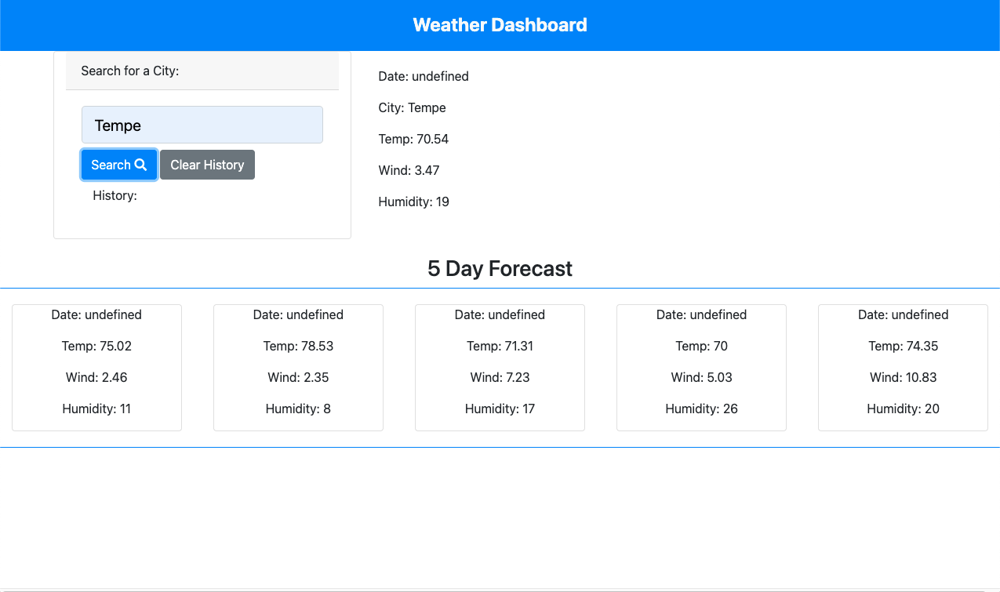

# Weather Dashboard

## User Story 

-AS A traveler    
-I WANT to see the weather outlook for multiple cities  
-SO THAT I can plan a trip accordingly  

## Built With 

-HTML  
-CSS  
-Javascript  
-Bootstrap   
-JQuery  
-Open Weather OneCall API  

## Deployed Project

-https://doolittle28.github.io/weather-dashboard/  

## Screenshot 

  
-Screenshot of deployed weather dashboard  

## Credits 

-https://stackoverflow.com/   
-https://developer.mozilla.org/en-US/  
-https://openweathermap.org/api/one-call-api  
